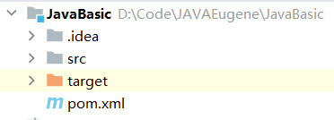
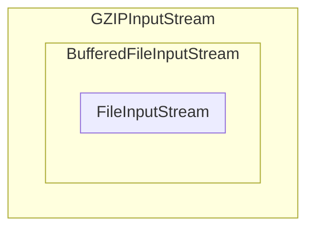

# IO

> IO流是一种顺序读写数据的模式，它的特点是单向流动。数据类似自来水一样在水管中流动，所以我们把它称为IO流。

## `IO` 的基本知识

### `InputStream` 与 `OutputStream`

`IO`流的**最小单位是**  因此又叫做`字节流`.&#x20;

`InputStream` 是**输入字节流**; `OutputStream` 是输出字节流. 这俩是**最基本的  流**.&#x20;

### `Reader` 与 `Writer`

`Reader` 和 `Writer` 是**字符流**, 其传输的**最小数据单位是** .

`Reader` 和 `Writer` 本质上是**可以自动编码解码的** `InputStream` 与 `OutputStream`.

### 同步和异步

同步 `IO`: 在进行 `IO` 读写时必须等待数据返回后才能继续执行其它代码.&#x20;

在 `java.io` 中提供了同步IO.&#x20;

异步 `IO`: 在进行 `IO` 读写时**仅发出请求**, 然后开始执行其它代码.&#x20;

在 `java.nio` 中提供了异步IO.&#x20;

前文中的 `InputStream`, `OutputStream`, `Reader` 和 `Writer` 都是 `同步IO` 的抽象类.&#x20;

而其对应的具体实现类有许多, 其中以文件方面的有: `FileInputStream`, `FileOutputStream`, `FileReader` 和 `FileWriter`.&#x20;

## `File` 对象

`java.io` 中提供的 `File` 对象可用于操作**文件和目录**.&#x20;

在构造 `File` 对象时需要传入文件路径:&#x20;

```java
String path = "C:\\Users\\Eugene\\Desktop\\Java_IO_Test.txt";
File file = new File(path);
```

`File` 对象有3种表示路径的形式.&#x20;

1.  `getPath()`: 返回构造对象时**传入的路径**;&#x20;

2.  `getAbsoluteFile()`: 返回**绝对路径**;&#x20;

3.  `getCanonicalPath()`: 返回**规范的**绝对路径, 且此方法必须要捕获 `IOException` 错误.&#x20;

```java
public class Main {
    public static void main(String[] args) {
        String path = ".";
        System.out.println((new File(path)).getPath());
        System.out.println((new File(path)).getAbsoluteFile());
        try {
            System.out.println((new File(path)).getCanonicalPath());
        } catch (IOException e) {
            System.out.println(e);
        }
    }
}
```

\*\*输出: \*\*

`.``D:\Code\JAVAEugene\JavaBasic\.``D:\Code\JAVAEugene\JavaBasic`

### 获取当前系统的路径分隔符

`File.separator` 此静态变量表示当前系统的分隔符.&#x20;

### 文件和目录

`File` 对象**既可以表示文件也可以表示目录**. 而且在构造 `File` 对象时传入的**路径不存在也不会报错**, 因为此时并**没有进行任何磁盘操作**.&#x20;

### `File` 对象的判断

`isFile()` 可以判断 `File` 对象是不是一个已存在的文件; `isDirectory()` 可以判断 `File` 对象是不是一个已存在的目录.&#x20;

```java
String path = ".";
System.out.println((new File(path)).isFile() ? "This is a File. " : "This is not a File. ");
System.out.println((new File(path)).isDirectory() ? "This is a Directory. " : "This is not a Directory. ");

```

**输出**: 
`This is not a File. ``This is a Directory. `

还可以进一步判断文件的权限和大小：

*   `boolean canRead()`: 是否可读;&#x20;

*   `boolean canWrite()`: 是否可写;&#x20;

*   `boolean canExecute()`: 是否可执行;&#x20;

*   `long length()`: 文件字节大小.&#x20;

### 创建和删除文件

`createNewFile()` 创建新文件;&#x20;

`delete()` 删除文件.&#x20;

```java
if(file.createNewFile()){
    System.out.println("File created successfully. ");
}
if(file.delete()){
    System.out.println("File deleted successfully. ");
}
```

### 创建临时文件

`createTempFile()`: 创建临时文件.&#x20;

```java
// 提供临时文件的前缀和后缀
File f = File.createTempFile("tmp-", ".txt");
// JVM退出时自动删除
f.deleteOnExit();
System.out.println(f.isFile());
System.out.println(f.getAbsolutePath());
```

### 遍历文件和目录

获取目录下的文件和子目录, 可以使用 `list()` 或 `listFiles()`.&#x20;

*   `list()` 返回文件和子目录的名称是**字符串数组**;&#x20;

*   `listFiles()`返回文件和子目录的 \*\* 对象数组\*\*.

给 `listFiles()` 传入 `FilenameFilter 匿名类` 后可以筛选出**指定格式的文件**.&#x20;

```java
public class Main {
    public static void main(String[] args) {
        String path = "C:\\Users\\Eugene\\Desktop\\Desktop";
        File file = new File(path);
        // 获取子文件和子目录的 File 对象数组
        File[] files = file.listFiles();
        // 获取子文件和子目录的 String 名称数组
        String[] filesName = file.list();
        printFiles(files);
        // 筛选指定格式的文件
        File[] files1 = file.listFiles(new FilenameFilter() {
            @Override
            public boolean accept(File dir, String name) {
                return name.endsWith(".xlsx");
            }
        });
        printFiles(files1);

        // 输出 String 名称数组
        if (filesName != null) {
            for (String f : filesName) {
                System.out.println(f);
            }
        }
    }
    private static void printFiles(File[] files) {
        System.out.println("**********");
        if (files != null) {
            for (File file : files) {
                System.out.println(file);
            }
        }
        System.out.println("**********\n");
    }
}

```

### 文件其它操作

*   `boolean mkdir()`: 创建当前 `File` 对象表示的目录;&#x20;

*   `boolean mkdirs()`: 创建当前 `File` 对象表示的目录, 并在必要时**将不存在的父目录也创建**出来;&#x20;

*   `boolean delete()`: 删除当前 `File` 对象表示的目录, 当前**目录必须为空**才能删除成功.&#x20;

### `Paths` 对象

```java
Path p1 = Paths.get(".");
// 转换为绝对路径
System.out.println(p1.toAbsolutePath());
// 转换为规范路径
System.out.println(p1.toAbsolutePath().normalize());
// 转换为File对象
System.out.println(Arrays.toString(p1.toFile().list()));

for (Path p : p1.toAbsolutePath()) {
    System.out.println(p);
}

```

\*\*输出: \*\*
`D:\Code\JAVAEugene\JavaBasic\.``D:\Code\JAVAEugene\JavaBasic``[.idea, pom.xml, src, target]`

```text
Code
JAVAEugene
JavaBasic
.
```



***

```java
String[] path = {
        "Documents",
            "word",
            "./1.docx",
            "./2.docx",
            "./word",
                "abc.doc",
        "../ppt",
        "./other"
};
```

## `InputStream`

是Java中最基本的输入流.&#x20;

`InputStream` 不是一个接口而是一个抽象类. 是所有输入流的超类.&#x20;

`InputStream` 最重要的方法是 `int read()` , 此方法会读取输入流的下一个字节, 并返回字节表示的 `int` 值 ∈ \[0, 255].&#x20;

若返回 `-1` 则表示读取完毕.&#x20;

`FileInputStream` 是 `InputStream` 的一个子类, 用于从文件流中读取数据.&#x20;

### 关闭流

`InputStream` 和 `OutputStream` 都是使用 `close()` 方法关闭流的.&#x20;

可以使用 `try...finally` 来保证总能关闭流.&#x20;

```java
InputStream in = null;
try {
    in = new FileInputStream("filePath");
    int n;
    while ((n = in.read()) != -1) {
        System.out.println(n);
    }
} catch (IOException e) {
    e.printStackTrace();
} finally {
    in.close();
}
```

### 自动关闭流

Java7引入了一种新的语法糖: `try(resource)` 自动资源管理, 可以让编译器帮我们自动关闭资源.&#x20;

```java
try (InputStream in = new FileInputStream("filePath")) {
    int n;
    while ((n = in.read()) != -1) {
        System.out.println(n);
    }
} catch (IOException e) {
    e.printStackTrace();
}
```

### 缓冲

为了高效地读取数据, 很多流支持一次性读取多个字节到缓冲区. `InputStream` 有两个重载方法来支持读取多个字节:&#x20;

*   `int read(byte[] b)`: 读取若干字节并填充到 `byte[]` 数组; 返回读取的字节数.&#x20;

*   `int read(byte[] b, int off, int len)`: 指定 `byte[]` 的数据的偏移量和最大填充数.&#x20;

使用缓冲区时, `read()` 方法返回的不再是字节的 `int值`, 而是**读取的字节数**; 若返回 `-1` 则表示读取完毕.&#x20;

```java
try (InputStream in = new FileInputStream("filePath")) {
    byte[] buffer = new byte[1024];
    int n;
    while ((n = in.read(buffer)) != -1) {
        System.out.printf("read %d bytes. ", n);
    }
}
```

### 阻塞

`read()` 方法是阻塞的 `(Blocking)`. 即在读取数据时, 后续代码无法被执行.&#x20;

```java
int n;
n = in.read();
int m = n; // 被阻塞, 需要等上一行读取完毕才能执行
```

### `InputStream` 实现类

`FileInputStream` 可以从文件获取输入流, 这是 `InputStream` 常用的一个实现类.&#x20;

`ByteArrayInputStream` 可以在内存中模拟一个 `InputStream`.&#x20;

```java
byte[] data = {72, 101, 108, 108, 111, 33};
try (InputStream in = new ByteArrayInputStream(data)) {
    int n;
    while ((n = in.read()) != -1) {
        System.out.printf("%d => %c \n", n, n);
    }
}
```

\*\*输出: \*\*
72 => H&#x20;
101 => e&#x20;
108 => l&#x20;
108 => l&#x20;
111 => o&#x20;
33 => !&#x20;

即 `ByteArrayInputStream` 是把一个 `byte[]` 数组在内存中变成 `InputStream`. 这可以用来构造一个 `InputStream` 做测试.&#x20;

## `OutputStream`

是Java中最基本的输出流.&#x20;

`OutputStream` 不是一个接口而是一个抽象类. 是所有输出流的超类.&#x20;

`OutputStream` 最重要的方法是 `void write(int b)`, 此方法会写入一个字节到输入流. 虽然传入的是 `int` 参数, 但**只会写入一个字节**. 即值写入 `int` 最低8位部分, 相当于 `b & 0xff`.&#x20;

> 📌`OutputStream` 提供了一个 `flush()` 方法, 用于将缓冲区的内容写入目的地.&#x20;
> 一般情况下不需要手动调用 `flush()`, 因为当缓冲区写满了后或者或者关闭流之前 `OutputStream` 会自动调用 `flush()` 来将缓冲区内容写入目的地.&#x20;

### `FileOutputStream`

`FileOutputStream` 方法可以逐个字节写入, 也可以一次性写入若干字节.&#x20;

```java
public void writeFile(String contents) {
    try (OutputStream out = new FileOutputStream(PATH)) {
        // 逐字节写入
        out.write(72)
        // 批量写入
        out.write(contents.getBytes(StandardCharsets.UTF_8));
    } catch (IOException e) {
        e.printStackTrace();
    }
}
```

### 阻塞

类似 `InputStream`, `OutputStream` 也是阻塞的.&#x20;

### `transferTo()`

此为Java9新增的方法: `InputStream.transferTo(OutputStream)`.&#x20;

此方法允许从对象调用方法表示的输入流中轻松传输 (复制) 字节到提供给该方法的输出流.&#x20;

## `Filter` 模式

通过一个 "基础" 组件再嵌套各种 "附加" 功能组件的模式, 叫做  `Filter 模式` (或者叫 `Decorator 装饰器模式`).&#x20;

1.  读取一个压缩包:&#x20;

    `InputStream file = new FileInputStream("test.gz");`

2.  &#x20;使用缓冲加速读取

    `InputStream buffered = new BufferedInputStream(file);`

3.  对已读取的文件解压缩

    `InputStream gzip = new GZIPInputStream(buffered);`

这样不管包装多少次, 最终的对象始终是 `InputStream`.&#x20;



## 序列化

序列化指把Java对象转变成二进制内容 (`byte[]` 数组). 序列化后便于持久化保存或者网络传输.&#x20;

反序列化指把一段二进制内容复原为Java对象.&#x20;

### `Serializable`

序列化Java对象需要实现 `java.io.Serializable` 这个接口. 此接口没有定义任何方法, 即这是一个 `Marker Interface 标记接口`.&#x20;

### `ObjectOutputStream`

序列化使用 `ObjectOutputStream` 来将Java对象写入一个字节流:&#x20;
