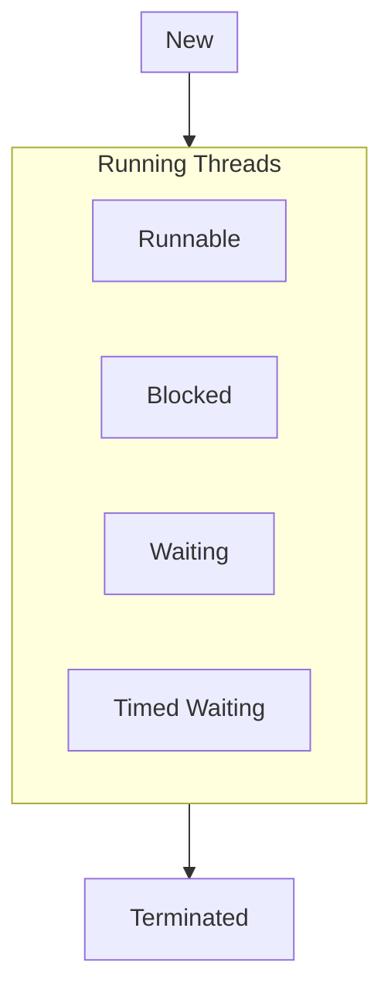

# 多线程

## 创建新线程

1. 实例化一个 `Thread` 对象, 再调用其 `start()` 方法. 

```java
public static void main(String[] args) {
    Thread thread = new Thread();
    thread.start();
}
```

但是这种方式启动的线程无法做任何事情.

2.  继承 `Thread`, 实现一个能做事的子类: 

```java
public class Multithreading {
    public static void main(String[] args) {
        Thread thread = new MyThread();
        thread.start();
    }
}

class MyThread extends Thread {
    @Override
    public void run() {
        System.out.println(MyThread.class.getSimpleName());
    }
}
```

**输出**: 
`MyThread`

3.  创建 `Thread` 实例时传入一个 `Runnable` 实例: 

```java
Thread thread1 = new Thread(new MyRunnable());
thread1.start();

class MyRunnable implements Runnable {
    @Override
    public void run() {
        System.out.println(MyRunnable.class.getSimpleName());
    }
}

```

**输出**:

`MyRunnable` 

或者使用 `lambda` 语法将其简写为: 

```java
Thread lambdaThread = new Thread(() -> {
    System.out.println("lambdaThread");
});
lambdaThread.start();
```

**输出**: 

`lambdaThread` 

## 多线程运行

对于代码: 

```java
public class Multithreading {
    public static void main(String[] args) {
        System.out.println("Main start...");
        Thread t = new Thread() {
            @Override
            public void run() {
                print("Thread", 100);
            }
        };
        t.start();
        print("🤣🤣🤣", 100);
    }

    private static void print(String name, int limit) {
        for (int i = 0; i < limit; i++) {
            System.out.printf("%s running! \t", name);
            if ((i + 1) % 5 == 0) {
                System.out.println();
            }
        }
    }
}
```

**输出**: (截取一部分)

>🤣🤣🤣 running! 	🤣🤣🤣 running! 	🤣🤣🤣 running! 	🤣🤣🤣 running! 	🤣🤣🤣 running! 	
>🤣🤣🤣 running! 	🤣🤣🤣 running! 	🤣🤣🤣 running! 	🤣🤣🤣 running! 	🤣🤣🤣 running! 	
>Thread running! 	Thread running! 	Thread running! 	Thread running! 	Thread running! 	
>Thread running! 	Thread running! 	Thread running! 	Thread running! 	Thread running! 	
>Thread running! 	Thread running! 	Thread running! 	Thread running! 	Thread running! 	
>Thread running! 	Thread running! 	Thread running! 	Thread running! 	Thread running! 	
>Thread running! 	Thread running! 	Thread running! 	Thread running! 	Thread running! 	
>Thread running! 	Thread running! 	Thread running! 	Thread running! 	Thread running! 	
>Thread running! 	Thread running! 	Thread running! 	Thread running! 	Thread running! 	
>Thread running! 	Thread running! 	Thread running! 	Thread running! 	Thread running! 	
>🤣🤣🤣 running! 	🤣🤣🤣 running! 	🤣🤣🤣 running! 	🤣🤣🤣 running! 	🤣🤣🤣 running! 	
>🤣🤣🤣 running! 	🤣🤣🤣 running! 	🤣🤣🤣 running! 	🤣🤣🤣 running! 	🤣🤣🤣 running!

即线程 `t` 与主线程 `main` 的调度是随机的, 由操作系统调度, 程序本身无法确定线程的调度顺序. 

### 线程的优先级

`Thread.setPriority(int n)` 方法可以设定线程的优先级, 取值范围: `[1, 10]`. 

## 线程的状态

一个线程对象只能调用一次 `star()` 方法. 在调用 `start()` 方法后新线程开始执行 `run()` 方法, 且在 `run()` 方法执行完毕后**结束进程**. 

因此 Java 线程的状态有如下几种: 

-   `New`: 新创建的线程, 但未执行;
-   `Runnable`: 运行中的线程, 正在执行 `run()` 方法; 
-   `Blocked`: 运行中的线程, 因为某些操作被阻塞而挂起; 
-   `Waiting`: 运行中的线程, 因为某些操作在等待; 
-   `Timed Waiting`: 运行中的线程, 因为执行 `sleep()` 方法而正在计时等待; 
-   `Terminated`: 线程已终止, 因为 `run()` 方法执行完毕. 

**状态转移图:** 



即当一个线程启动后, 它会在 `Runnable`、`Blocked`、`Waiting` 和 `Timed Waiting` 这几个状态中切换, 直到变成 `Terminated` 状态. 

线程终止的原因: 

-   线程正常终止: `run()` 方法执行完毕; 
-   线程意外终止: `run()` 方法因未捕获的异常而导致线程终止; 
-   对某线程的 `Thread` 实例调用 `stop()` 方法而强制终止 (不建议使用). 

### `join()` 等待线程结束

一个线程可以等待另一个线程结束. 在 `main()` 里启动线程 `t` 后, 可以通过 `t.join()` 等待 `t` 线程结束后再运行 `main()`: 

>`t.join()` 会将 `main()` 挂起. 

```java
public class Multithreading {
    public static void main(String[] args) throws InterruptedException {
        Thread thread = new MyThread("🤣🤣🤣");
        System.out.println("Start");
        thread.start();
        // 将 main() 线程挂起, 等待 t 线程结束后才继续执行
        thread.join();
        Run.run("Main");
        System.out.println("End");
    }
}

class MyThread extends Thread {
    private static String name;

    public MyThread(String n) {
        name = n;
    }

    @Override
    public void run() {
        Run.run(name);
    }
}

class Run {
    public static void run(String name) {
        for (int i = 0; i < 100; i++) {
            System.out.printf("%s running~\t", name);
            if ((i + 1) % 5 == 0) {
                System.out.println();
            }
        }
    }
}
```

**输出**: (截选)

`main()` 线程的输出全部都在 `t` 的输出的后面. 

>🤣🤣🤣 running~	🤣🤣🤣 running~	🤣🤣🤣 running~	🤣🤣🤣 running~	🤣🤣🤣 running~	
>🤣🤣🤣 running~	🤣🤣🤣 running~	🤣🤣🤣 running~	🤣🤣🤣 running~	🤣🤣🤣 running~	
>🤣🤣🤣 running~	🤣🤣🤣 running~	🤣🤣🤣 running~	🤣🤣🤣 running~	🤣🤣🤣 running~	
>🤣🤣🤣 running~	🤣🤣🤣 running~	🤣🤣🤣 running~	🤣🤣🤣 running~	🤣🤣🤣 running~	
>🤣🤣🤣 running~	🤣🤣🤣 running~	🤣🤣🤣 running~	🤣🤣🤣 running~	🤣🤣🤣 running~	
>🤣🤣🤣 running~	🤣🤣🤣 running~	🤣🤣🤣 running~	🤣🤣🤣 running~	🤣🤣🤣 running~	
>Main running~	Main running~	Main running~	Main running~	Main running~	
>Main running~	Main running~	Main running~	Main running~	Main running~	
>Main running~	Main running~	Main running~	Main running~	Main running~	
>Main running~	Main running~	Main running~	Main running~	Main running~	
>Main running~	Main running~	Main running~	Main running~	Main running~	
>Main running~	Main running~	Main running~	Main running~	Main running~	

若将 `t.join()` 注释掉后的输出: (截选)

此时 `main()` 和 `t` 的输出就混在一起了. 

>   Main running~	Main running~	Main running~	Main running~	Main running~	
>   Main running~	Main running~	Main running~	Main running~	Main running~	
>   Main running~	Main running~	Main running~	Main running~	Main running~	
>   Main running~	Main running~	Main running~	Main running~	Main running~	
>   🤣🤣🤣 running~	🤣🤣🤣 running~	🤣🤣🤣 running~	🤣🤣🤣 running~	🤣🤣🤣 running~	
>   🤣🤣🤣 running~	🤣🤣🤣 running~	🤣🤣🤣 running~	🤣🤣🤣 running~	🤣🤣🤣 running~	
>   🤣🤣🤣 running~	🤣🤣🤣 running~	🤣🤣🤣 running~	🤣🤣🤣 running~	Main running~	Main running~	Main running~	Main running~	Main running~	
>   Main running~	Main running~	Main running~	Main running~	Main running~	

## 中断线程

若某线程在执行任务期间需要被中断, 那么由**其它线程**给它发送一个信号, 该线程收到信号后结束执行 `run()` 方法便使得自身立刻结束运行. 

如从网络下载 100MB 的文件时, 若用户取消下载, 就需要中断下载线程的执行. 

在其它线程中对目标线程执行 `interrupt()` 方法即可将其中断. 
