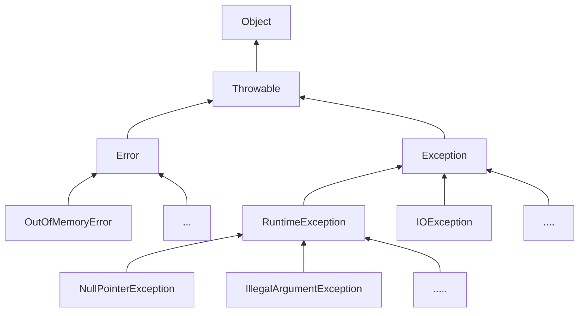

# 异常处理

## 异常



`Error` 代表错误, 程序对此无能为力; 

`Exception` 代表异常, 它可以被捕获处理. 

*   必须捕获的异常: `Exception` 及其子类, 但不包括 `RuntimeException`. 

*   不需要捕获的异常，包括`Error`及其子类，`RuntimeException`及其子类。

在定义方法时, 需要使用 `throws XXX` 来表示此方法有可能抛出的异常类型. 当此方法被调用时必须强制捕获这些异常, 否则无法编译. 

## 捕获异常

### 多 `catch` 语句

```java
public static void main(String[] args) {
    try {
        process1();
        process2();
        process3();
    } catch (IOException e) {
        System.out.println(e);
    } catch (NumberFormatException e) {
        System.out.println(e);
    }
}
```

JVM在捕获到异常后会从上到下匹配 `catch` 语句, 若匹配到某个 `catch` 后便跳出 `try` 语句块. (类似 `switch`) 

`catch` 的捕获顺序要从小到大: **子类必须写在前面**. 如: 

```java
public static void main(String[] args) {
    try {
        process1();
        process2();
        process3();
    } catch (IOException e) {
        System.out.println("IO error");
    } catch (UnsupportedEncodingException e) { // 永远捕获不到
        System.out.println("Bad encoding");
    }
}
```

由于 `UnsupportedEncodingException` 是 `IOException` 的子类, 所以 `UnsupportedEncodingException` 无法被捕获到.  

### `finally`

在 `finally` 语句块内的内容, 不管有没有异常都会无条件执行. 

```java
public static void main(String[] args) {
    try {
        process1();
        process2();
        process3();
    } catch (UnsupportedEncodingException e) {
        System.out.println("Bad encoding");
    } catch (IOException e) {
        System.out.println("IO error");
    } finally {
        System.out.println("Try-Catch END. ");
    }
}
```
