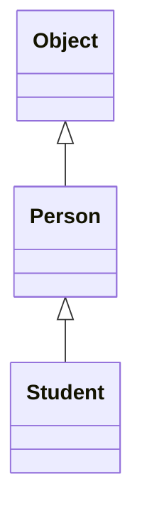

# 面向对象基础

## 类与实例

`class`是一种对象模板, 依据此模板创建出来的对象叫实例`instance`

### 创建实例

定义一个引用类型的变量来指向这个实例

```java
Person eugene = new Person();
```

即声明一个 `Person`类型的变量 `eugene`, 用其指向一个 `Person()`实例. 

> 📌 一个 `Java`源文件可以包含多个类的定义, 但只能定义一个 `public`类, 且 `public`类名必须与文件名一致. 如果要定义多个`public`类, 必须拆到多个`Java`源文件中. 

## 方法

类的函数. 

一个类通过定义方法, 可以给外部代码暴露一些操作的接口, 同时内部自己保证逻辑一致性. 

### `this` 变量

若参数与类本身的 `字段 (field)` 重名, 则可用 `this` 变量指向类本身的字段. 

```java
class Person {
    private String name;
    public void setName(String name) {
        // 区分参数变量与类的字段. 
        this.name = name;
    }
}
```

### 可变参数

`类型...` 语法用于定义不定长的参数. 相当于数组类型. 

```java
class Group {
    private String[] names;

    public void setNames(String... names) {
        this.names = names;
    }
}

// 调用时可以直接传入不定长的参数: 
Group group = new Group();
group.setNames("Xiao Ming", "Xiao Hong", "Xiao Jun");

```

> 📌可变参数可以保证无法传入`null`，因为传入0个参数时，接收到的实际值是一个空数组而不是`null`. 

> 📌除了基本类型之外的所有类型, 包括数组的赋值, 都是引用传递. 
>
> Java定义了以下几种基本数据类型：
> 
> 整数类型：byte，short，int，long
> 
> 浮点数类型：float，double
> 
> 字符类型：char
> 
> 布尔类型：boolean

## 构造方法

创建对象实例时, 通过构造方法初始化实例. 

```java
class Person {
    private String name;
    private int age;

    public Person(String name, int age) {
        this.name = name;
        this.age = age;
    }
}
```

### 初始化顺序

若在定义字段时直接进行初始化, 同时在构造方法中对字段初始化, 则最终结果与构造方法中的一致. 

```java
class Person {
    private String name = "Unamed";
    private int age = 10;

    public Person(String name, int age) {
        this.name = name;
        this.age = age;
    }
}
```

1.  先初始化字段，例如 `int age = 10;` 表示字段初始化为 `10`; `double salary;` 表示字段默认初始化为 `0`; `String name;` 表示引用类型字段默认初始化为 `null`；

2.  执行构造方法的代码进行初始化。

### 多构造方法

一个构造方法调用其他构造方法的语法是 `this(…)`

```java
class Person {
    private String name;
    private int age;

    public Person(String name, int age) {
        this.name = name;
        this.age = age;
    }

    public Person(String name) {
        this(name, 18); // 调用另一个构造方法Person(String, int)
    }

    public Person() {
        this("Unnamed"); // 调用另一个构造方法Person(String)
    }
}
```

## 方法重载 `Overload`

若多个方法**名字相同参数不同**, 则这些方法叫同名方法. 

`String` 类提供了多个重载方法 `indexOf()`，可以查找子串：

*   `int indexOf(int ch)`：根据字符的Unicode码查找；

*   `int indexOf(String str)`：根据字符串查找；

*   `int indexOf(int ch, int fromIndex)`：根据字符查找，但指定起始位置；

*   `int indexOf(String str, int fromIndex)`根据字符串查找，但指定起始位置。

> 📌方法重载的返回值类型通常都是相同的. 

## 继承

子类获得父类的所有功能, 且子类可以拥有新增或更改后的功能. 

```java
/*
 * 父类, 提供基础的属性与方法. 
 * */
class Person {
    private String name;
    private int age;

    public String getName() {...}

    public void setName(String name) {...}

    public int getAge() {...}

    public void setAge(int age) {...}
}

/*
 * 子类, 继承父类的属性与方法后可以新增属于自己的属性和方法. 
 * */
class Student extends Person {
    // 不要重复name和age字段/方法,
    // 只需要定义新增score字段/方法:
    private int score;

    public int getScore() { … }

    public void setScore(int score) { … }
}
```

父类 (`parent class`), 又称超类 (`super class`), 基类 (`base class`); 

子类 (`subclass`), 又称扩展类 (`extended class`). 

> 📌子类自动获得了父类的所有字段, 严禁定义与父类重名的字段! 

### 继承树

某个类没有写 `extends` 的类会被视为继承自 `Object`. 即除了`Object`, 每个类都会继承自某个类. 



> 📌子类只允许继承一个父类, 除了 `Object`外, 所有类有且仅有一个父类. 

### protected

子类**无法访问**父类的`private`字段或者`private`方法. 

若把 `private`类型改为 `protected`类型, 则 `protected`类型的字段和方法可以被自己, 子类和子孙类所继承. **即可以把字段和方法的访问权限控制在继承树内部**. 

### super

若父类没有`无参构造方法`, 则子类要显式地调用父类的构造方法, 并给出参数以便让编译器定位到父类的一个合适的构造方法. 

> 📌子类不会继承任何父类的构造方法。子类默认的构造方法是编译器自动生成的，不是继承的。

### 阻止继承

使用 `final`关键字修饰的类不允许被继承. 

### 向上转型

类似`Person p = new Student();`这样的声明方式, 即使用父类类型的变量指向子类类型的实例

但是对 `p`能使用的方法都只局限于 `Person`类的方法, 无法调用 `Student`类的方法. 

### 向下转型

类似`Person p = new Student();`这样的向上转型声明方式, 可以用 `Student s = (Student) p;`这样的强制转换实现向下转型, 即将父类类型的变量转为子类类型. 其实这应该算一种 "纠正", 将原本不一致的指向纠正回来. 

而类似 `Person p = new Person();`这种变量与实例均为父类的情况, 无法通过 `Student s = (Student) p;`这种方式转为子类类型, 会报错`runtime error! ClassCastException!`. 毕竟变量 `p`本身与其指向的实例均为父类, 不含有子类的功能, 自然无法强转为子类. 

为了避免向下转型出错, 可以用 `instanceof`关键字来判断 `变量A`是否是 `类B本身或其子类`的实例. 

```java
Person p = new Person();
System.out.println(p instanceof Person); // true
System.out.println(p instanceof Student); // false

Student s = new Student();
System.out.println(s instanceof Person); // true
System.out.println(s instanceof Student); // true

Student n = null;
System.out.println(n instanceof Student); // false
```

## 多态

### 覆写 `Override`

子类中定义一个与父类的方法签名完全相同的方法, 叫做覆写. 

方法签名相同: 指的是方法名相同, 方法参数相同, 方法返回值相同. 

> 📌方法名相同, 方法参数相同, 但方法返回值不同, 也是不同的方法. 
> 这种情况会报错, 因为不知道调用方需要哪种返回类型. 

在向上转型例子中: `Person p = new Student();`若父类 `Person`有方法 `run()`, 子类 `Student`对其覆写后再执行 `p.run()`, 将会运行子类的 `run()`方法, 而不是父类的. 

即: Java的实例方法调用是基于运行时的**实际类型**的动态调用, 而非变量的声明类型. `引用类型 p = new 实际类型;`

一个方法的形参可以只写一种引用类型, 而传入其子类的实际类型. 如: 

```java
public static double totalTax(Income... incomes) {
    double total = 0;
    for (Income income : incomes) {
        total += income.getTax();
    }
    return total;
}
```

在此方法中形式参数是 `Income`类型的可变参数, 但是传入的实际类型可以为 `Income`, `Salary`和 `StateCouncilSpecialAllowance`等 `Income`的子类. 

也就是说在传入的时候执行了向上转型: 变量 `incomes`是 `Income`类型, 但是可以指向其子类类型. 因此可以调用被子类覆写后的 `getTax()`方法. 

多态允许添加更多类型的子类实现功能扩展, 且不需要修改基于父类的代码. 

## 抽象类

抽象类定义了规范. 它只能用于被继承; 只定义方法, 但不写方法的具体实现; 无法被实例化. 

### 面向抽象编程

```java
abstract class Person {
    public abstract void run();
}

class Student extends Person {
    @Override
    public void run() {
        System.out.println("Student.run");
    }
}

class Teacher extends Person {
    @Override
    public void run() {
        System.out.println("Teacher.run");
    }
}

```

若**通过抽象类去引用具体的子类示例**的方式叫做面向抽象编程: 

```java
// 抽象类型的变量指向具体子类的实例
Person s = new Student();
Person t = new Teacher();
```

> 📌尽量引用高层类型, 避免引用实际子类型. 
>
> 面向抽象编程的本质就是: 
> 1\. 上层代码只定义规范 (例如：abstract class Person); 
> 2\. 不需要子类就可以实现业务逻辑 (正常编译); 
> 3\. 具体的业务逻辑由不同的子类实现, 调用者并不关心. 

## 接口

若一个抽象类**没有字段**, 全是抽象方法, 则应该将其写为 `接口 interface`

```java
public interface Person {
    void run();
    String getName();
}

```

接口定义的所有方法默认都是`public abstract`, 因此写不写`public abstract`都一样. 

一个类只能继承自另一个类, 但是**一个类可以实现多个** .

```java
class Student implements Person, Hello { 
    // 实现了两个interface
    ...
}
```

## 静态字段和静态方法

### 静态字段

一个类的所有实例共享的字段, 叫做 `静态字段`

```java
public class Person {
    // num 字段为静态字段
    public static int num;
    ...
}
```

在上述代码中, 类 `Person`的所有实例都可以访问同一个静态字段 `num`. 

```java
Person eugene = new Person();
// 一下两种访问方式均合法
// 但是更推荐第二种方式. 
eugene.num = 10;
Person.num = 10;
```

这就像`Person`的所有实例组成一个班级, 其中的所有学生**共享同一块黑板**. 

### 静态方法

调用 `实例方法`需要通过一个实例变量, 而 `静态方法`只通过类名就可以调用. 

`静态方法`属于类, 不属于实例. 所以在**静态方法内部无法访问****变量和实例字段**, 只能访问静态字段. 

相当于其它语言的 `命名空间.函数`

### 接口的静态字段

虽然 `interface`不能定义实例字段, 但是可以定义静态字段, 但**其静态字段必须为****类型**. 

```java
public interface Person {
    public static final int AGE = 0;
    int SCORE = 1;
}
```

由于接口的静态字段必须为 `public static final`类型, 所以写不写修饰符都一样. 

## 包

Java用`package`来解决命名冲突. 包定义了一个命名空间, 

### 包作用域

不用 `public`, `protected` 和 `private` 修饰的字段与方法就是包作用域. 

在同一个package内的class可以访问包作用域的field和method. 

即: 不用 `public`, `protected` 和 `private` 修饰的字段与方法相当于只能在包内访问的 `public`, 在包外不能访问的 `private`. 

### 导包

假设小明的 `ming.Person` 类想要调用小军的 `mr.jun.Arrays` 类: 

1.  调用时写出完整类名. 

    ```java
    package ming;
    public class Person{
        public void run(){
            // 写全类名调用
            mr.jun.Arrays arrays = new mr.jun.Arrays();
        }
    }
    ```

2.  用`import`导入. 

    1.  导入特定的某个class

        ```java
        // 导入
        import mr.jun.Arrays;

        ...
            // 调用
            Arrays arrays = new Arrays();

        ```

    2.  导入某个package下所有的class

        ```java
        import mr.jun.*;
        ...
            Arrays arrays = new Arrays();
        
        ```

        但是当导入的包过多后, 这种方式难以一眼看出某个class属于哪个package. 

3.  导入类的静态字段和静态方法. 

    ```java
    import static java.lang.System.*;
    ...
        out.println("Hello, Java! ");
    
    ```

### 包的优先级

*   若导入的是完整类名， 则直接根据类名调用此class.

*   若是简单类名: 

    1.  查找当前package下是否存在此class; 

    2.  查找import导入的包中是否存在此class; 

    3.  查找 `java.lang` 包中是否存在此class. 

> 📌也就是说: 编译器会自动帮我们 `import 当前package下的class` 和自动 `import java.lang.*;`

### 避免命名冲突

常用**倒置的域名**来保持唯一性. 

```java
import org.apache; 
import org.apache.commons.log;
import com.liaoxuefeng.sample;
```

子包可以安装功能来命名. 

## 作用域

`public`, `protected` 和 `private` 修饰符用来限定访问作用域. 

### `public`

`public` 类型的class和interface可以被其它任何class访问. 

若其它class能访问class A, 那么其它class也能访问A的 `public field`和 `public method`. 

### `private`

`private` 类型的field和method不能被其它class访问. 即private将被修饰的field或method的访问权限制在了class内部. 

### `protected`

不能被实例直接访问, 但是可以被子类直接访问. 权限高于 `public` 低于 `private`. 

### `final`

`final` 类型的类**不能被继承**; 

`final` 类型的方法**不能被覆写**. 

`final` 类型的变量是**常量**. 

## 内部类

### 成员内部类

`Inner Class` 是被定义在一个类内部的 `成员内部类`. 

```java
class Outer {
    class Inner {
        // 定义了一个Inner Class
    }
}
```

成员内部类可以**无限制地访问外部类的所有字段与方法**. 

创建一个内部类示例: 

```java
Outer out = new Outer();
Outer.Inner in = out.new Inner();
```

或者不用创建 `Outer` 实例, 直接创建 `Inner` 实例: 

`Outer.Inner in = new Outer().new Inner();`

#### 外部类访问内部类

外部类想要访问内部类需要**实例化一个内部类**. 

```java
public class Outer {
    public Outer() {
        // 实例化一个内部类
        new Inner().hello();
    }
    public class Inner {
        public void hello() {
            System.out.println("Inner.hello");
        }
    }
}

public class Main {
    public static void main(String[] args) {
        // 会打印 "Inner.hello"
        Outer outer = new Outer();
    }
}

```

### 匿名类`Anonymous Class`

在方法内部**调用的时候才实现**的类. 

#### 匿名内部类的基本实现

1.  匿名实现接口

2.  匿名实现抽象类

3.  匿名实现 `Thread`类和 `Runnable`类

其实 1, 2 都可归纳为: 将子类上转型为父类类型. 

```java
interface SayHelloInterface {
    void hello();
}

abstract class SayHelloAbstract {
    void hello() {
        System.out.println("hello");
    }
}

class SayHelloClass implements SayHelloInterface {
    @Override
    public void hello() {
        System.out.println("上转型为接口实现匿名类");
    }
}

class SayHelloClass_2 extends SayHelloAbstract {
    @Override
    void hello() {
        System.out.println("上转型为抽象类实现匿名类");
    }
}

public class AnonymousClass {
    public SayHelloInterface helloInterface;
    public SayHelloAbstract helloAbstract;

    public AnonymousClass() {
        // 在实例化时实现接口
        // 被实现的类默认 implements 了此接口, 但是它没有名字
        helloInterface = new SayHelloInterface() {
            @Override
            public void hello() {
                System.out.println("匿名实现 Interface. ");
            }
        };
        // 在实例化时实现抽象类
        // 被实现的类默认 extends 了此抽象类, 但是它没有名字
        helloAbstract = new SayHelloAbstract() {
            @Override
            void hello() {
                System.out.println("匿名实现 Abstract. ");
            }
        };
        // 上转型
        // 将继承了接口或抽象类的子类上转型为接口或抽象类
        SayHelloAbstract sayHelloAbstract = new SayHelloClass_2();
        SayHelloInterface sayHelloInterface = new SayHelloClass();
        // 匿名实现 Thread 类
        Thread thread = new Thread() {
            @Override
            public void run() {
                System.out.println("匿名实现 Thread 类");
            }
        };
        // 匿名实现 Runnable 类
        Runnable runnable = new Runnable() {
            @Override
            public void run() {
                System.out.println("匿名实现 Runnable 类");
            }
        };
        Thread t = new Thread(runnable);

        helloInterface.hello();
        helloAbstract.hello();
        sayHelloAbstract.hello();
        sayHelloInterface.hello();
        thread.start();
        t.start();
    }
}
```

### 静态内部类 (Static Nested Class)

它与成员内部类相似, 不过使用 `static` 修饰. 

```java
public class Main {
    public static void main(String[] args) {
        StaticNested.InnerStaticNested innerStaticNested = new StaticNested.InnerStaticNested();
        innerStaticNested.hello();
    }
}

class StaticNested {
    private static String NAME = "StaticNested".toUpperCase();
    private String name;

    public StaticNested(String name) {
        this.name = name;
    }

    public static class InnerStaticNested {
        public void hello() {
            System.out.println("Hello, " + StaticNested.NAME);
        }
    }
}

```

# `classpath`与 `jar`

`classpath`是 `JVM` 使用到的环境变量, `JVM`可以据此去寻找目标 `class`. 

`classpath`的设定方法: 

1.  启动 `JVM` 时设置 `classpath`. (推荐做法)

    `java -classpath .;C:\work\project1\bin;C:\shared abc.xyz.Hello`

    或者使用 `-cp` 短参数

    `java -cp .;C:\work\project1\bin;C:\shared abc.xyz.Hello`

2.  在系统环境变量设置 `classpath`. (不推荐)

若没有设置系统环境变量, 也没有传入 `-cp` 参数, 则 `JVM` 默认的 `classpath`为当前目录. 
